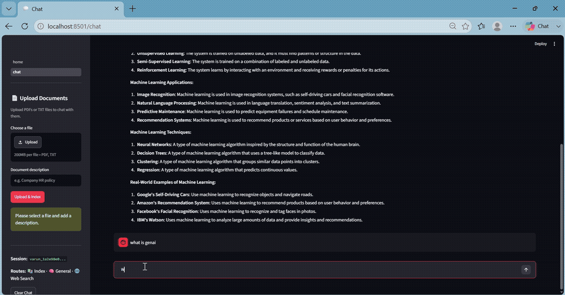

# 🧠 AdaptiveRag — LangGraph-Powered Agentic RAG Chatbot

An intelligent Retrieval-Augmented Generation (RAG) system that dynamically routes user queries to the most appropriate knowledge source using LangGraph-powered agentic workflows. Fully deployed with FastAPI backend on Railway and Streamlit frontend on Streamlit Cloud.

[](https://adaptiverag-2exurkjkfenfsb6n7mcpcp.streamlit.app/)

---

## 🚀 Live Demo

🔗 **[Try the live app here](https://adaptiverag-2exurkjkfenfsb6n7mcpcp.streamlit.app/)**

Upload any PDF or TXT → Ask questions → Get intelligent answers powered by LangGraph agentic routing.

---

## 🎬 Demo



---

## ⚙️ How It Works

```
User Query → LangGraph Router
├── 📚 Index Route  → Searches uploaded documents (Qdrant)
├── 🧠 General Route → Answers using LLM knowledge (Groq)
└── 🌐 Search Route  → Fetches real-time web results (Tavily)
```

Each route includes:
- Document grading (relevance checking)
- Query rewriting (if no relevant docs found)
- Answer generation (Llama 3.3 70B via Groq)

---

## 🛠️ Tech Stack

| Layer            | Technology                      |
|------------------|---------------------------------|
| Agentic Workflow | LangGraph                       |
| LLM              | Groq (Llama 3.3 70B)            |
| Vector Database  | Qdrant Cloud                    |
| Embeddings       | HuggingFace (all-MiniLM-L6-v2)  |
| Web Search       | Tavily API                      |
| Chat Memory      | MongoDB Atlas                   |
| Backend          | FastAPI (deployed on Railway)   |
| Frontend         | Streamlit (deployed on Streamlit Cloud) |

---

## ✨ Features

- 🔀 Adaptive query routing across 3 intelligent routes
- 📄 PDF and TXT document upload & vector indexing
- ✅ Document relevance grading before answering
- 🔁 Automatic query rewriting when docs are irrelevant
- 💬 Persistent chat history per session (MongoDB)
- 🌐 Real-time web search integration via Tavily
- 🚀 Fully deployed — accessible via public URL

---

## 🏗️ Architecture

```
Streamlit Frontend (Streamlit Cloud)
        ↓ HTTP requests
FastAPI Backend (Railway)
        ↓
LangGraph Agentic Workflow
    ├── Qdrant Cloud (vector store)
    ├── Groq LLM (Llama 3.3 70B)
    ├── Tavily (web search)
    └── MongoDB Atlas (chat memory)
```

---

## 📁 Project Structure

```
AdaptiveRag/
├── src/
│   ├── api/              # FastAPI routes
│   ├── config/           # Settings and prompts
│   ├── core/             # Logger
│   ├── db/               # MongoDB client
│   ├── llms/             # Groq LLM setup
│   ├── memory/           # Chat history
│   ├── models/           # Pydantic schemas
│   └── rag/              # Core RAG pipeline
│       ├── graph_builder.py   # LangGraph workflow
│       ├── nodes.py           # Agent nodes
│       ├── retriever_setup.py
│       └── document_upload.py
├── streamlit_app/        # Frontend UI
├── Procfile              # Railway deployment config
├── railway.json          # Railway settings
├── runtime.txt           # Python 3.11
└── requirements.txt
```

---

## 🔧 Local Setup & Installation

**1. Clone the repo**
```bash
git clone https://github.com/varun0852/AdaptiveRag.git
cd AdaptiveRag
```

**2. Create virtual environment**
```bash
python -m venv venv
venv\Scripts\activate   # Windows
source venv/bin/activate  # Mac/Linux
```

**3. Install dependencies**
```bash
pip install -r requirements.txt
```

**4. Create `.env` file**
```env
GROQ_API_KEY=your_key
TAVILY_API_KEY=your_key
QDRANT_URL=your_url
QDRANT_API_KEY=your_key
QDRANT_DOCS_COLLECTION=documents
MONGODB_URL=your_url
MONGODB_DB_NAME=adaptive_rag
```

**5. Run the backend**
```bash
uvicorn src.main:app --reload --port 8000
```

**6. Run the frontend**
```bash
streamlit run streamlit_app/home.py
```

---

## ☁️ Deployment

| Service  | Platform       | URL |
|----------|----------------|-----|
| Backend  | Railway        | `https://web-production-c7b0c.up.railway.app` |
| Frontend | Streamlit Cloud | [Live App](https://adaptiverag-2exurkjkfenfsb6n7mcpcp.streamlit.app/chat) |

---

## 👤 Author

**Varun** — AI/ML Engineer

[](https://www.linkedin.com/in/varun-a87781274/)
[](https://github.com/varun0852)
[](mailto:diwakarvarun752@gmail.com)
